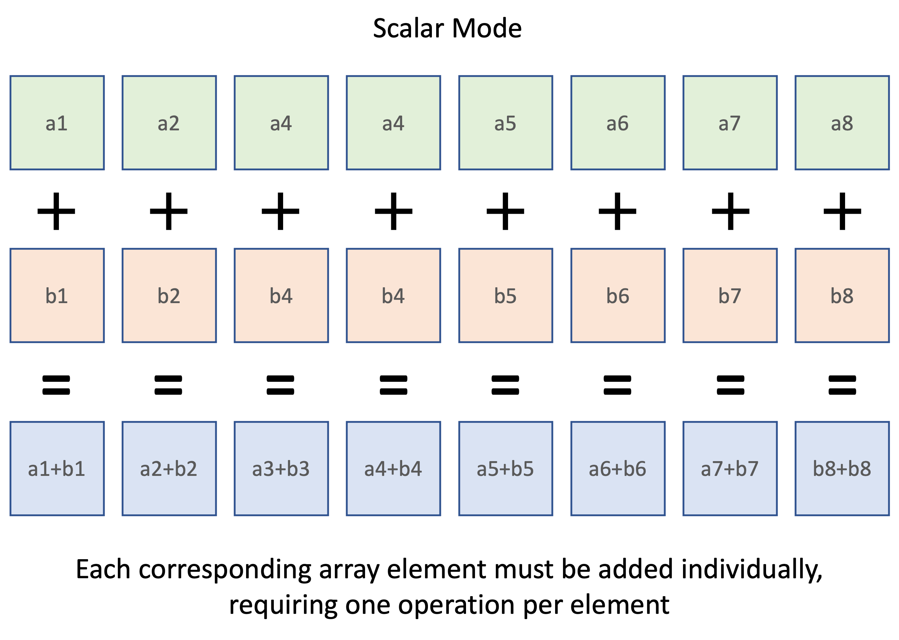

# WebAssembly SIMD Instructions

The documentation surrounding how WebAssembly instructions are to be used can only be described as "*very poor*".
There is a [comprehensive core language specification](https://webassembly.github.io/spec/core/), but this is suitable only for designers of the language itself, and is generally unhelpful for developers wishing to make use these of instructions in an application.

This is particularly true of the SIMD instructions whose argument of often supplied in a non-intuitive order.

Here is a first attempt to provide some worked examples of each WebAssembly SIMD instruction.

***THIS IS A WORK IN PRGRESS***

## The SIMD Concept

SIMD is the acronym for ***S***ingle ***I***nstruction, ***M***ultiple ***D***ata and it refers to a set of machine instructions that accelerate processing by simulatneously operating on multiple units of data in the time taken to execute a single instruction.

A simple example is adding two arrays.

Below is a naïve JavaScript implementation for adding the corresponding elements of two, equally sized arrays:

```javascript
const scalar_addition = (a, b) => {
  let result = []

  for (let i = 0; i < a.length; i++) {
    result.push(a[i] + b[i])
  }

  return result
}

let array1 = [1, 2, 3, 4, 5, 6, 7, 8]
let array2 = [11, 12, 13, 14, 15, 16, 17, 18]

scalar_addition(array1, array2)  // [ 12, 14, 16, 18, 20, 22, 24, 26 ]
```

The number of operations needed to perform this task can be illustrated like this:



That's all fine, but since we know that both arrays contain the same number of elements, it would be much more efficient to execute this addition in parallel.
This is exactly what the SIMD instructions allow you to do.

Here's the same array addition implemented as a single SIMD instruction:


## SIMD 'Lanes'

In the above example, we used an array containing 8 numbers.
If we now assume that each number is stored as a 16-bit integer, then altogether these numbers will occupy `8 * 16 bits = 128 bits` of storage.

SIMD uses the concept of 'lanes' as a way of subdividing a block of 128 bits.
Typically, a SIMD instruction must be told not only what operation to perform on the 128-vector, but also how that vector should be subdivded.


The way in which the 128-bit vector is subdivided is known as its `shape` and there are 6 possible shapes: 4 integer shapes and 2 floating point shapes:

| Datatype | 8-bit | 16-bit | 32-bit | 64-bit |
|---|--:|--:|--:|--:|
| Integer | `i8x16` | `i16x8` | `i32x4`| `i64x2`
| Floating point | | | `f32x4` | `f64x2` |


## Splat

`splat` creates a 128-bit vector with an identical value in each lane, then pushes the result onto the stack.
There are 6 versions of `splat`; one for each vector shape:

```wast
;; Create a vector with 16 8-bit lanes each containing 0xFF
(i8x16.splat (i32.const 0xff))

;; Create a vector with 8 16-bit lanes each containing 0x0a0b
(i16x8.splat (i32.const 0x0a0b))

;; Create a vector with 4 32-bit lanes each containing 0xdeadbeef
(i32x4.splat (i32.const 0xdeadbeef))
```

Given that WebAssembly does not have explicit datatypes for 8- or 16-bit integers, if you wish to use an 8- or 16-bit initial value, that must be supplied in an `i32`.


## Swizzle

The word ["Swizzle"](https://www.diffordsguide.com/encyclopedia/317/cocktails/swizzles-and-how-to-swizzle-a-cocktail) comes from the world of cocktail making and means "*to mix things up*".

So in WebAssembly, if you `swizzle` a 128-bit vector, you are rearranging the bytes identified by the first argument, according to the list of indices supplied in the second.

A good use of `swizzle` is when you need to swap the endiannes of 16 bytes of data:

```wast
(i8x16.swizzle
  (v128.load (local.get $in_val_ptr))
  (v128.const i8x16 3 2 1 0 7 6 5 4 11 10 9 8 15 14 13 12)  ;; Rearrange the 16 bytes into this order
)
```

Notice that the first argument to `v128.const` must be the vector's shape.
