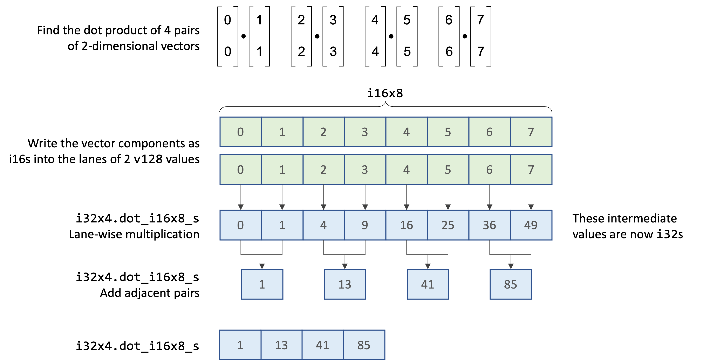

# Dot Product

The dot product of two vectors is the sum of the products of the vector components. For example:

$$
\begin{bmatrix}1 \\\2 \end{bmatrix}\dot{}\begin{bmatrix}3 \\\4 \end{bmatrix} \equiv (1 * 3) + (2 * 4) = 14
$$

$$
\begin{bmatrix}1 \\\2 \\\3 \end{bmatrix}\dot{}\begin{bmatrix}4 \\\5 \\\6 \end{bmatrix} \equiv (1 * 4) + (2 * 5) + (3 * 6) = 32
$$

For a more detailed explanation of why the dot product is useful and how it can be derived, watch [Grant Sanderson's excellent video](https://www.youtube.com/watch?v=LyGKycYT2v0), which is part of a larger series on the [Essence of Linear Algebra](https://www.3blue1brown.com/topics/linear-algebra)
