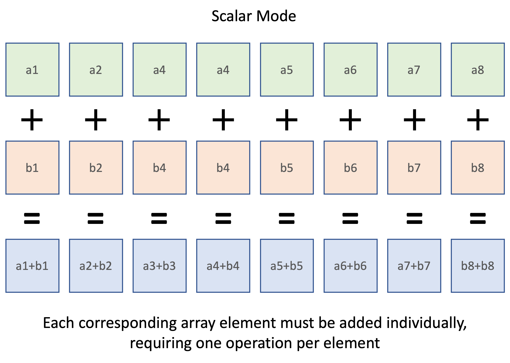
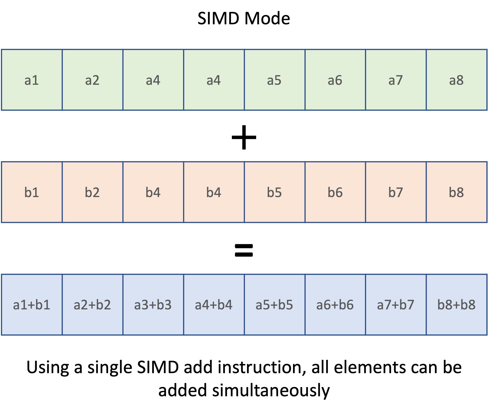
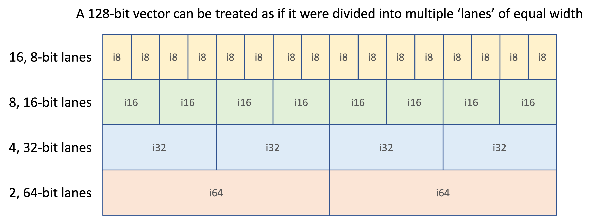

# The SIMD Concept

SIMD is the acronym for ***S***ingle ***I***nstruction, ***M***ultiple ***D***ata and it refers to a set of machine instructions that accelerate processing by simulatneously operating on multiple units of data in the time taken to execute a single instruction.

A simple example is adding two arrays.

Below is a naïve JavaScript implementation for adding the corresponding elements of two, equally sized arrays:

```javascript
const scalar_addition = (a, b) => {
  let result = []

  for (let i = 0; i < a.length; i++) {
    result.push(a[i] + b[i])
  }

  return result
}

let array1 = [1, 2, 3, 4, 5, 6, 7, 8]
let array2 = [11, 12, 13, 14, 15, 16, 17, 18]

scalar_addition(array1, array2)  // [ 12, 14, 16, 18, 20, 22, 24, 26 ]
```

The number of operations needed to perform this task can be illustrated like this:



That's all fine, but since we know that both arrays contain the same number of elements, it would be much more efficient to execute this addition in parallel.
This is exactly what the SIMD instructions allow you to do.

Here's the same array addition implemented as a single SIMD instruction:



## SIMD 'Lanes'

In the above example, we used an array containing 8 numbers.
If we now assume that each number is stored as a 16-bit integer, then altogether these numbers will occupy `8 * 16 bits = 128 bits` of storage.

SIMD uses the concept of 'lanes' as a way of subdividing a block of 128 bits.
Typically, a SIMD instruction must be told not only what operation to perform on the 128-vector, but also how that vector should be subdivded.



The way in which the 128-bit vector is subdivided is known as its `shape` and there are 6 possible shapes: 4 integer shapes and 2 floating point shapes:

| Datatype | 8-bit | 16-bit | 32-bit | 64-bit |
|---|--:|--:|--:|--:|
| Integer | `i8x16` | `i16x8` | `i32x4`| `i64x2`
| Floating point | | | `f32x4` | `f64x2` |
