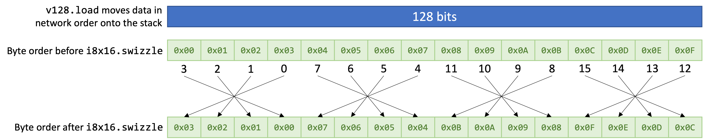

# Swizzle

The word ["Swizzle"](https://www.diffordsguide.com/encyclopedia/317/cocktails/swizzles-and-how-to-swizzle-a-cocktail) comes from the world of cocktail making and means "*to mix things up*".
So if you `swizzle` a 128-bit vector, you are rearranging the bytes of the first argument, according to the list of indices supplied in the second.

## But Why Would I need This?

There are lots of situations in which you might need to rearranging the byte order of some block of data, but a good example is where you need to reverse the [endianness](https://en.wikipedia.org/wiki/Endianness) of some data.

You may well encounter a situation in which the host environment has written some data to shared memory (E.G. the contents of a file), then the WebAssembly program needs to process that data.

The host environment will typically have written the file contents to memory in network byte order, but WebAssembly can only see integer datatypes.

The bottom line here is WebAssembly has no `raw` datatype.

If you issue the `i32.load` instruction, in addition to copying 4 bytes from memory onto the stack, you have implicitly told WebAssembly that because these bytes represent an integer (do they?), they occur in the order specified the endianness of your CPU &mdash; which nowadays, is almost certainly going to be little-endian.

Therefore, if the raw data in memory appears as `0x01020304`, but you read it as if it were a 32-bit integer (an `i32`), WebAssembly will assume the bytes occur in little-endian byte order and helpfully reverse them before writing the value to the top of the stack.

So instead of the expected `0x01020304` appearing on the top of the stack, you now get `0x04030201`!


This is a good example of where `swizzle` can be used to reverse the endianness of 4, 32-bit values in a single instruction:

```wast
(func $swap_endianness
      (param $raw_data_ptr i32)
      (result v128)

  (i8x16.swizzle
    (v128.load (local.get $raw_data_ptr))
    (v128.const i8x16 3 2 1 0 7 6 5 4 11 10 9 8 15 14 13 12)
  )
)
```

Notice that the first argument to `v128.const` must be the vector's shape.


